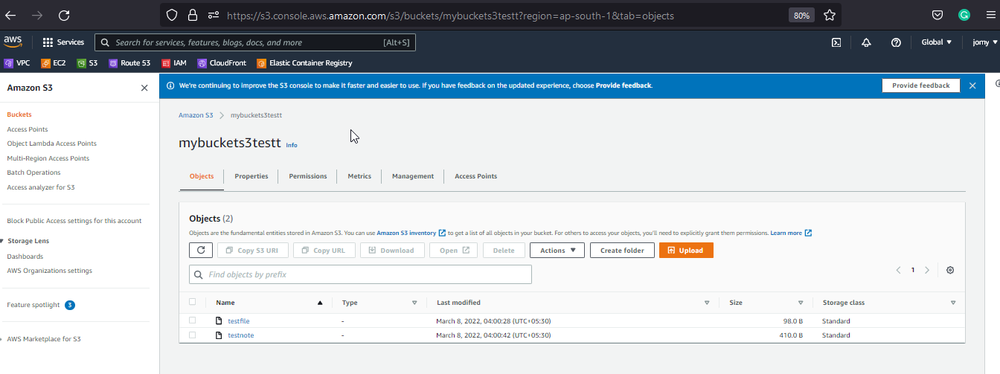

# Mount-S3-Bucket-on-amazon-linux-using-S3FS

[](https://travis-ci.org/joemccann/dillinger)


## Description

S3FS is FUSE (File System in User Space) based solution to mount an Amazon S3 buckets, We can use system commands with this drive just like as another Hard Disk in the system. On s3fs mounted files systems we can simply use cp, mv and ls the basic Unix commands similar to run on locally attached disks.

## Pre-Requests

- IAM User with programmatic access
- Need to install or configure the aws cli. By default the amazon ec2 have awscli and moslty no need to install

## Steps to deploy

### Step-1: Just update the system
```
yum update -y
```
### Step-3: We need to install all the dependencies for fuse and s3cmd. Install the required packages to system use following command.
```
yum install automake fuse fuse-devel gcc-c++ git libcurl-devel libxml2-devel make openssl-devel -y
```

### Step-3: Download s3fs source code from git which is official

```
git clone https://github.com/s3fs-fuse/s3fs-fuse.git
```
### Step-4: Now Compile and install the code
```
cd  s3fs-fuse
./autogen.sh 
./configure -prefix=/usr -with-openssl
make
sudo make install
```
### Step-5: Use below command to check where s3fs command is placed in os
```
# which s3fs
/usr/bin/s3fs
```
### Step-6: Setup Access Key
#### Also In order to configure s3fs, we would require Access Key and Secret Key of your S3 Amazon account
```
echo AWS_ACCESS_KEY_ID:AWS_SECRET_ACCESS_KEY > ~/.passwd-s3fs
chmod 755 ~/.passwd-s3fs
```
### Step-7: Mount S3 Bucket
```
mkdir /tmp/cache /s3mnt
s3fs -o use_cache=/tmp/cache <s3bucketname> /s3mnt
```
### Step-8: Add the path to the server fstab otherwise it will broke on reboot. Please add the below
```
<bucketname>         /s3mnt  fuse.s3fs       _netdev,allow_other     0       0
```
## Output
```
# df -h
Filesystem      Size  Used Avail Use% Mounted on
devtmpfs        475M     0  475M   0% /dev
tmpfs           483M     0  483M   0% /dev/shm
tmpfs           483M  444K  483M   1% /run
tmpfs           483M     0  483M   0% /sys/fs/cgroup
/dev/xvda1      8.0G  1.8G  6.3G  23% /
s3fs             16E     0   16E   0% /s3mnt              >>>>>>>>>>>>>>>>>> This is s3-bucket which we have mouunted

[root@ip-172-31-42-176 s3mnt]# ll
total 1
-rw-r--r-- 1 root root  98 Mar  7 22:30 testfile
-rw-r--r-- 1 root root 410 Mar  7 22:30 testnote
[root@ip-172-31-42-176 s3mnt]# pwd
/s3mnt

```

### Sample outputs of s3-bucket

<center> </img></center>

## Conclusion

Succesfully mounted the s3-bucket on amazon linux. Try it yourself

#### ⚙️ Connect with Me

<p align="center">
<a href="mailto:jomyambattil@gmail.com"></a>
<a href="https://www.linkedin.com/in/jomygeorge11"></a> 
<a href="https://www.instagram.com/therealjomy"></a><br />
